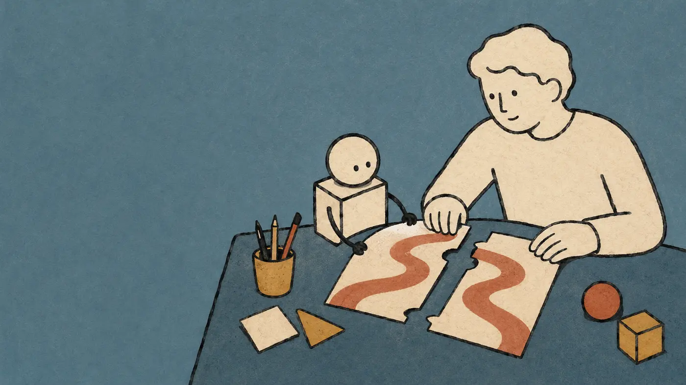
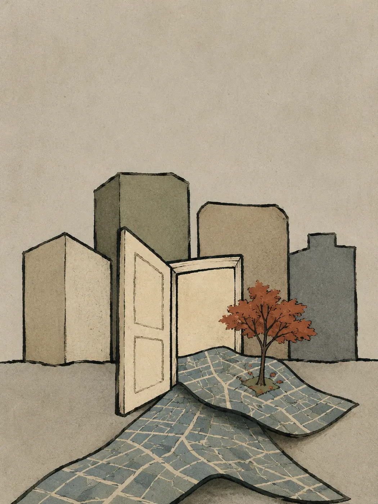
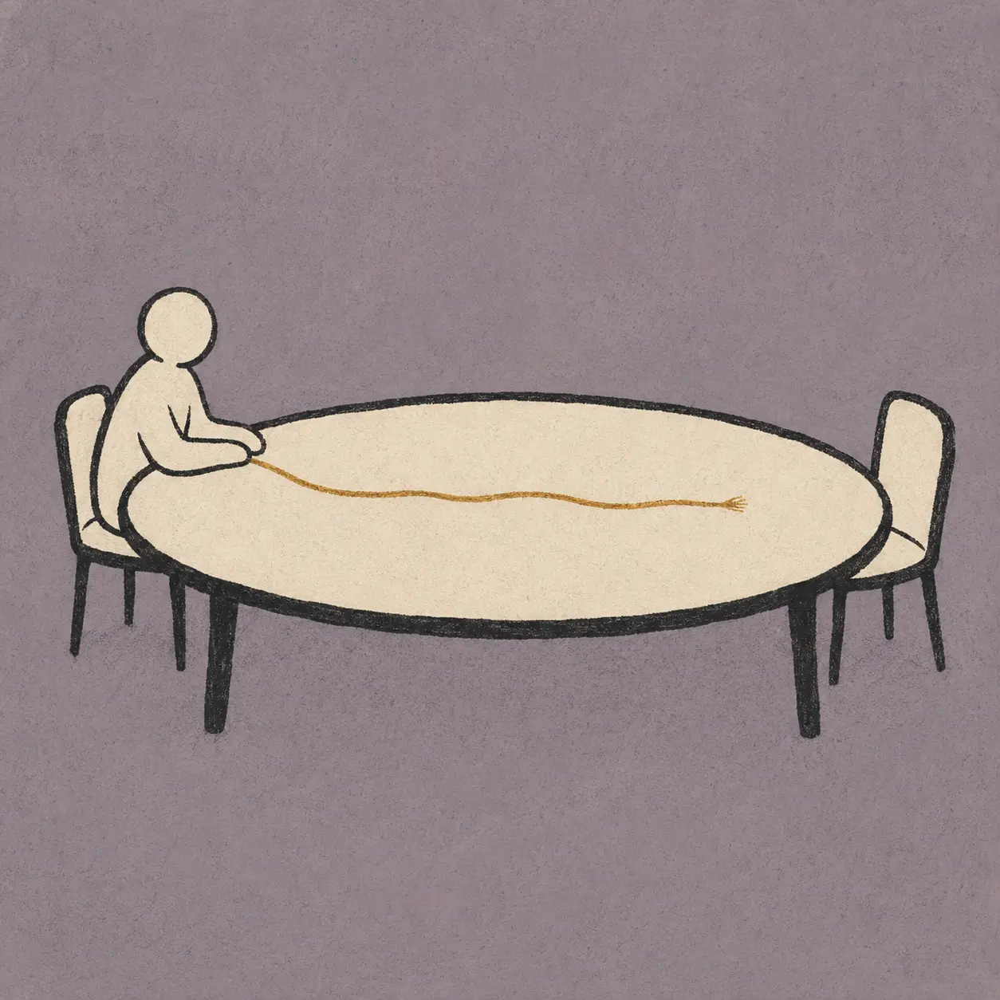

# 墨线概念插画

**Ivory Ink Illustration** 是一个面向 ChatGPT / Codex 的图像生成 Skill。它把简短主题自动转化为具有粗黑手绘线条、象牙白主体、低饱和色块和清晰视觉隐喻的编辑型概念插画，适合 PPT、文章配图、报告封面和社交媒体图片。

> 独立开源项目，不隶属于任何商业品牌，也不以复刻特定品牌或艺术家的作品为目标。

## 效果预览

| PPT 封面：人与 AI 协作 | 文章配图：信息过载 |
| --- | --- |
|  |  |

| 竖版封面：城市记忆 | 方形配图：孤独感 |
| --- | --- |
|  |  |

更多样例见 [`examples/`](examples/)。

## 核心能力

- 只输入主题也能自动提炼一个主要视觉隐喻。
- 根据用途自动选择 16:9、4:3、3:4 或 1:1 构图。
- 稳定使用粗黑不规则墨线、温暖象牙白主体和低饱和背景。
- 自动为 PPT 或封面预留标题空间，且不生成占位文字。
- 限制城市、地图和基础设施题材的重复细节。
- 直接调用图像生成工具输出图片，而不是只返回提示词。

## 快速使用

只输入主题：

```text
用 $ivory-ink-illustration 生成一幅关于“城市记忆”的插画。
```

指定使用场景：

```text
用 $ivory-ink-illustration 生成“人与 AI 协作”的 16:9 PPT 封面，左侧留出标题空间。
```

```text
Use $ivory-ink-illustration to create a portrait report cover about architectural heritage conservation.
```

## 默认版式

| 使用场景 | 默认比例 | 构图规则 |
| --- | --- | --- |
| 仅输入主题 | 4:3 | 居中概念插画，保留适度留白 |
| PPT 封面或章节页 | 16:9 | 主体偏向一侧，约三分之一画面用于标题 |
| 文章或报告配图 | 4:3 | 平衡的中心构图 |
| 竖版封面或海报 | 3:4 | 上方保留标题空间 |
| 社交媒体配图 | 1:1 | 单一中心轮廓 |

## 安装

1. 下载或克隆本仓库。
2. 找到内层 [`ivory-ink-illustration/`](ivory-ink-illustration/) 文件夹。
3. 在 ChatGPT 的 Skills 页面导入该文件夹。
4. 在对话中使用 `$ivory-ink-illustration` 调用。

Skill 文件夹内只包含运行所需内容；README、评测报告和示例图保留在仓库外层。

## 项目结构

```text
ivory-ink-illustration/
├── README.md
├── EVALUATION.md
├── LICENSE
├── examples/
│   ├── *.webp
│   └── PROMPTS.md
└── ivory-ink-illustration/
    ├── SKILL.md
    ├── agents/
    │   └── openai.yaml
    └── references/
        └── style-guide.md
```

## 验证结果

`v0.1.0` 使用九个跨题材、跨版式案例进行验证，八个达到发布阈值，平均得分为 **90.1/100**。测试方法、评分和已知限制见 [`EVALUATION.md`](EVALUATION.md)。

## 已知限制

- 复杂城市鸟瞰、地图和基础设施题材仍可能产生过多细节。
- 图像模型无法保证每次生成结果完全一致。
- 不适合替代要求精确尺寸、数据或标签的技术图纸和信息图。
- 图中出现大量或精确文字时，仍需单独校对。

## License

MIT License。详见 [`LICENSE`](LICENSE)。

---

**English summary:** A ChatGPT / Codex skill that turns a short theme into a restrained editorial concept illustration with bold irregular charcoal lines, warm ivory forms, muted flat colors, simple metaphors, and layout-aware negative space.
